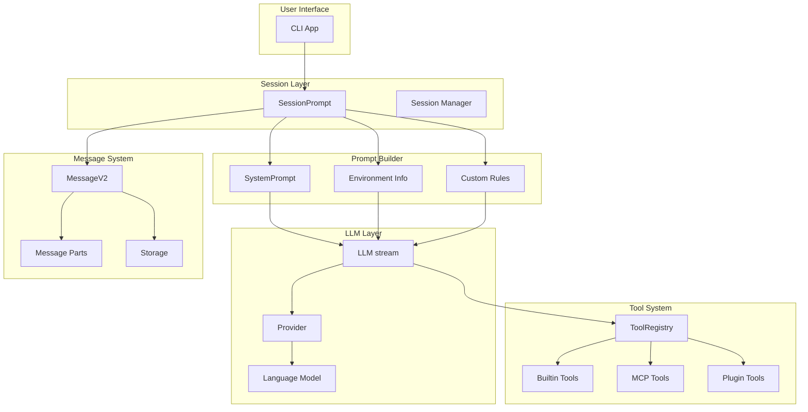
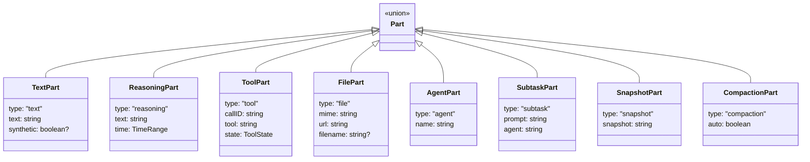
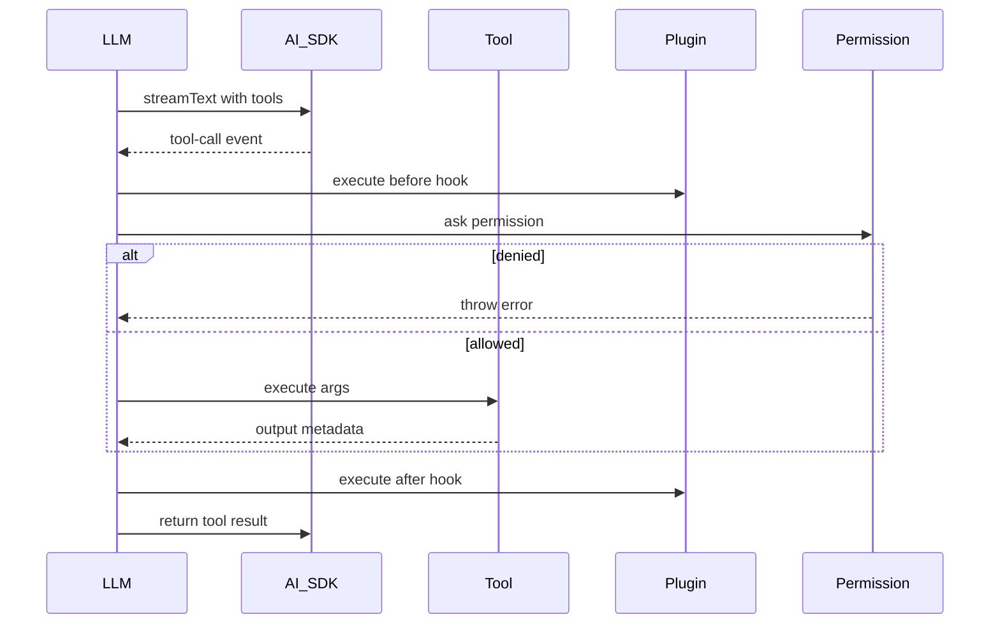
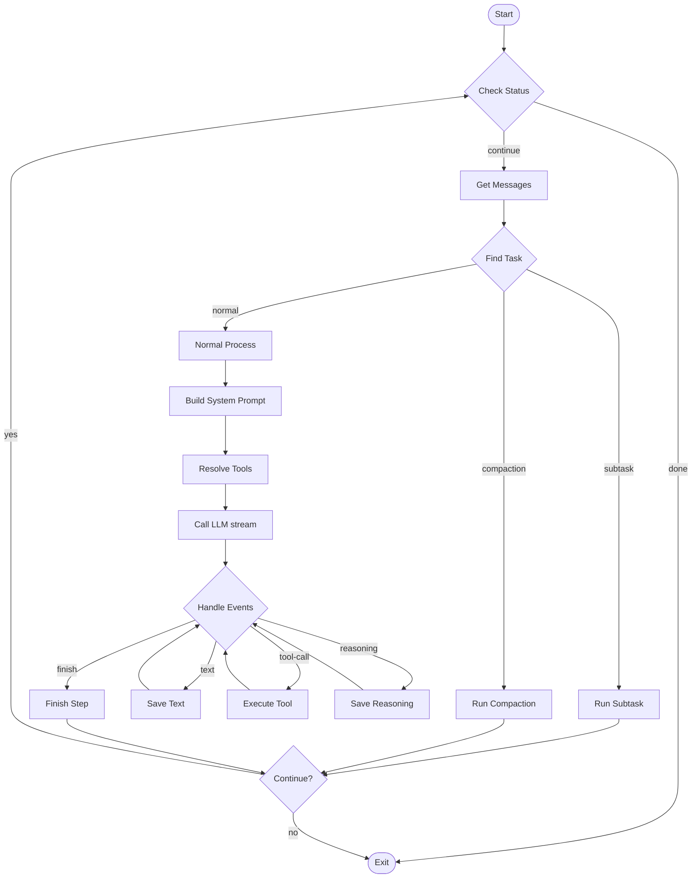

# OpenCode Prompt 与 Agent 架构分析

本文档分析 OpenCode 的 prompt 系统、聊天历史管理和 tool calls 实现，帮助理解如何构建类似的 AI Agent。

## 目录

- [架构概览](#架构概览)
- [System Prompt 系统](#system-prompt-系统)
- [Chat History 管理](#chat-history-管理)
- [Tool Calls 实现](#tool-calls-实现)
- [Agent 定义](#agent-定义)
- [核心处理循环](#核心处理循环)
- [关键文件清单](#关键文件清单)

---

## 架构概览



---

## System Prompt 系统

### 文件位置

| 文件 | 作用 |
|-----|------|
| `packages/opencode/src/session/system.ts` | System Prompt 主控制器 |
| `packages/opencode/src/session/prompt/*.txt` | 各模型的 Prompt 模板 |

### Prompt 模板文件

```
packages/opencode/src/session/prompt/
├── anthropic.txt          # Claude 模型专用 (8KB)
├── anthropic_spoof.txt    # Anthropic header spoof
├── beast.txt              # GPT-4/4o 专用 (11KB)
├── gemini.txt             # Gemini 专用 (14KB)
├── qwen.txt               # Qwen 模型
├── codex.txt              # GitHub Copilot Codex
├── codex_header.txt       # Codex 指令头
├── plan.txt               # Plan 模式提示
├── build-switch.txt       # Build 切换提示
├── max-steps.txt          # 最大步数提示
├── compaction.txt         # 消息压缩 Agent 提示
└── explore.txt            # Explore Agent 提示
```

### SystemPrompt 命名空间

```typescript
// packages/opencode/src/session/system.ts

export namespace SystemPrompt {
  // 1. Header - Provider 特定的头部（如 Anthropic spoof）
  export function header(providerID: string) {
    if (providerID.includes("anthropic")) return [PROMPT_ANTHROPIC_SPOOF.trim()]
    return []
  }

  // 2. Provider - 根据模型选择对应的 prompt 模板
  export function provider(model: Provider.Model) {
    if (model.api.id.includes("gpt-5")) return [PROMPT_CODEX]
    if (model.api.id.includes("gpt-") || model.api.id.includes("o1") || model.api.id.includes("o3"))
      return [PROMPT_BEAST]
    if (model.api.id.includes("gemini-")) return [PROMPT_GEMINI]
    if (model.api.id.includes("claude")) return [PROMPT_ANTHROPIC]
    return [PROMPT_ANTHROPIC_WITHOUT_TODO]  // 默认使用 qwen.txt
  }

  // 3. Environment - 运行环境信息
  export async function environment() {
    return [
      `<env>`,
      `  Working directory: ${Instance.directory}`,
      `  Is directory a git repo: ${project.vcs === "git" ? "yes" : "no"}`,
      `  Platform: ${process.platform}`,
      `  Today's date: ${new Date().toDateString()}`,
      `</env>`,
    ].join("\n")
  }

  // 4. Custom - 自定义规则文件
  // 搜索顺序: AGENTS.md > CLAUDE.md > CONTEXT.md（本地）
  //          ~/.config/opencode/AGENTS.md > ~/.claude/CLAUDE.md（全局）
  export async function custom() {
    // 从本地和全局配置目录加载规则文件
    // 支持 URL 远程加载指令
  }
}
```

### Prompt 组装流程

```mermaid
sequenceDiagram
    participant Loop as SessionPrompt
    participant LLM as LLM
    participant SYS as SystemPrompt
    participant Prov as Provider

    Loop->>LLM: call stream
    LLM->>SYS: header
    SYS-->>LLM: Anthropic spoof
    LLM->>SYS: provider
    SYS-->>LLM: model prompt
    LLM->>SYS: environment
    SYS-->>LLM: env info
    LLM->>SYS: custom
    SYS-->>LLM: user rules
    LLM->>Prov: streamText
```

### 最终 System Prompt 结构

```typescript
// packages/opencode/src/session/llm.ts:68-81

const system = SystemPrompt.header(input.model.providerID)
system.push(
  [
    // Agent 自定义 prompt 或 Provider prompt
    ...(input.agent.prompt ? [input.agent.prompt] : SystemPrompt.provider(input.model)),
    // 调用时传入的额外 system prompt
    ...input.system,
    // 用户消息中的 system 字段
    ...(input.user.system ? [input.user.system] : []),
  ].filter(Boolean).join("\n"),
)

// 发送给模型时的消息结构
messages: [
  // System messages (或 Codex 模式下作为 user message)
  ...system.map(x => ({ role: "system", content: x })),
  // Chat history
  ...input.messages,
]
```

---

## Chat History 管理

### 消息结构定义

```typescript
// packages/opencode/src/session/message-v2.ts

export namespace MessageV2 {
  // 用户消息
  export const User = z.object({
    id: z.string(),
    sessionID: z.string(),
    role: z.literal("user"),
    time: z.object({ created: z.number() }),
    agent: z.string(),                    // 使用的 agent 名称
    model: z.object({                     // 使用的模型
      providerID: z.string(),
      modelID: z.string(),
    }),
    system: z.string().optional(),        // 用户级 system prompt
    tools: z.record(z.string(), z.boolean()).optional(),
    variant: z.string().optional(),
  })

  // 助手消息
  export const Assistant = z.object({
    id: z.string(),
    sessionID: z.string(),
    role: z.literal("assistant"),
    parentID: z.string(),                 // 关联的用户消息 ID
    modelID: z.string(),
    providerID: z.string(),
    agent: z.string(),
    path: z.object({ cwd: z.string(), root: z.string() }),
    cost: z.number(),                     // API 调用成本
    tokens: z.object({                    // Token 使用量
      input: z.number(),
      output: z.number(),
      reasoning: z.number(),
      cache: z.object({ read: z.number(), write: z.number() }),
    }),
    finish: z.string().optional(),        // 完成原因
    error: z.discriminatedUnion(...).optional(),
  })
}
```

### Message Parts 类型



### 消息转换为模型格式

```typescript
// packages/opencode/src/session/message-v2.ts:435

export function toModelMessage(input: WithParts[]): ModelMessage[] {
  const result: UIMessage[] = []

  for (const msg of input) {
    if (msg.info.role === "user") {
      const userMessage: UIMessage = { id: msg.info.id, role: "user", parts: [] }
      for (const part of msg.parts) {
        if (part.type === "text" && !part.ignored)
          userMessage.parts.push({ type: "text", text: part.text })
        if (part.type === "file" && part.mime !== "text/plain")
          userMessage.parts.push({ type: "file", url: part.url, mediaType: part.mime })
        // ... 其他 part 类型处理
      }
      result.push(userMessage)
    }

    if (msg.info.role === "assistant") {
      const assistantMessage: UIMessage = { id: msg.info.id, role: "assistant", parts: [] }
      for (const part of msg.parts) {
        if (part.type === "text")
          assistantMessage.parts.push({ type: "text", text: part.text })
        if (part.type === "tool" && part.state.status === "completed") {
          assistantMessage.parts.push({
            type: `tool-${part.tool}`,
            state: "output-available",
            toolCallId: part.callID,
            input: part.state.input,
            output: part.state.output,
          })
        }
        // ... 其他处理
      }
      result.push(assistantMessage)
    }
  }

  return convertToModelMessages(result)  // 使用 AI SDK 转换
}
```

### 消息压缩 (Compaction)

当 context 超出限制时，自动压缩历史消息：

```typescript
// packages/opencode/src/session/compaction.ts

// 检测是否需要压缩
if (await SessionCompaction.isOverflow({ tokens: lastFinished.tokens, model })) {
  await SessionCompaction.create({
    sessionID,
    agent: lastUser.agent,
    model: lastUser.model,
    auto: true,
  })
}
```

---

## Tool Calls 实现

### Tool 接口定义

```typescript
// packages/opencode/src/tool/tool.ts

export namespace Tool {
  export type Context = {
    sessionID: string
    messageID: string
    agent: string
    abort: AbortSignal
    callID?: string
    extra?: Record<string, any>
    metadata(input: { title?: string; metadata?: any }): void
    ask(input: PermissionRequest): Promise<void>  // 权限请求
  }

  export interface Info<Parameters extends z.ZodType, Metadata> {
    id: string
    init: (ctx?: InitContext) => Promise<{
      description: string
      parameters: Parameters              // Zod schema
      execute(
        args: z.infer<Parameters>,
        ctx: Context,
      ): Promise<{
        title: string
        metadata: Metadata
        output: string                    // 返回给模型的文本
        attachments?: FilePart[]          // 附件（如图片）
      }>
      formatValidationError?(error: z.ZodError): string
    }>
  }

  // 定义 Tool 的辅助函数
  export function define<P, M>(id: string, init: ...): Info<P, M>
}
```

### 内置 Tools 列表

```typescript
// packages/opencode/src/tool/registry.ts

export namespace ToolRegistry {
  async function all(): Promise<Tool.Info[]> {
    return [
      InvalidTool,           // 处理无效 tool 调用
      QuestionTool,          // 向用户提问
      BashTool,              // Shell 命令执行
      ReadTool,              // 文件读取
      GlobTool,              // 文件模式匹配
      GrepTool,              // 代码搜索
      EditTool,              // 文件编辑
      WriteTool,             // 文件写入
      TaskTool,              // 子任务/Subagent
      WebFetchTool,          // 网页获取
      TodoWriteTool,         // Todo 写入
      TodoReadTool,          // Todo 读取
      WebSearchTool,         // Web 搜索
      CodeSearchTool,        // 代码搜索
      SkillTool,             // 自定义技能/Slash Command
      LspTool,               // 语言服务器
      PlanExitTool,          // 退出 Plan 模式
      PlanEnterTool,         // 进入 Plan 模式
      ...custom,             // 插件自定义 Tools
    ]
  }
}
```

### Tool 执行流程



### Tool 包装和注册

```typescript
// packages/opencode/src/session/prompt.ts:688-726

async function resolveTools(input) {
  const tools: Record<string, AITool> = {}

  for (const item of await ToolRegistry.tools(providerID, agent)) {
    const schema = ProviderTransform.schema(model, z.toJSONSchema(item.parameters))

    tools[item.id] = tool({
      id: item.id,
      description: item.description,
      inputSchema: jsonSchema(schema),
      async execute(args, options) {
        const ctx = context(args, options)

        // Before hook
        await Plugin.trigger("tool.execute.before", { tool: item.id, sessionID }, { args })

        // 执行 tool
        const result = await item.execute(args, ctx)

        // After hook
        await Plugin.trigger("tool.execute.after", { tool: item.id, sessionID }, result)

        return result
      },
      toModelOutput(result) {
        return { type: "text", value: result.output }
      },
    })
  }

  // 添加 MCP tools
  for (const [key, item] of Object.entries(await MCP.tools())) {
    tools[key] = item
  }

  return tools
}
```

### MCP (Model Context Protocol) 集成

```typescript
// packages/opencode/src/mcp/index.ts

export namespace MCP {
  // 获取所有 MCP tools
  export async function tools(): Promise<Record<string, DynamicTool>>

  // 获取 MCP prompts
  export async function prompts(): Promise<McpPrompt[]>

  // 读取 MCP resource
  export async function readResource(clientName: string, uri: string)

  // OAuth 认证
  export async function authenticate(clientName: string)
}
```

---

## Agent 定义

### Agent 接口

```typescript
// packages/opencode/src/agent/agent.ts

export namespace Agent {
  export const Info = z.object({
    name: z.string(),
    description: z.string().optional(),
    mode: z.enum(["subagent", "primary", "all"]),
    native: z.boolean().optional(),        // 是否为内置 agent
    hidden: z.boolean().optional(),        // 是否隐藏
    topP: z.number().optional(),
    temperature: z.number().optional(),
    color: z.string().optional(),
    permission: PermissionNext.Ruleset,    // 权限规则
    model: z.object({                      // 覆盖默认模型
      modelID: z.string(),
      providerID: z.string(),
    }).optional(),
    prompt: z.string().optional(),         // 自定义 system prompt
    options: z.record(z.any()),            // 模型特定选项
    steps: z.number().int().positive().optional(),  // 最大步数
  })
}
```

### 内置 Agents

| Agent | Mode | 描述 | 特殊权限 |
|-------|------|------|----------|
| `build` | primary | 主 Agent，执行代码修改 | question: allow, plan_enter: allow |
| `plan` | primary | 规划 Agent，制定计划 | question: allow, plan_exit: allow, edit: 仅 plan 文件 |
| `general` | subagent | 通用子 Agent，多任务并行 | todoread/write: deny |
| `explore` | subagent | 快速探索，仅读访问 | 仅 grep/glob/read/bash 等只读工具 |
| `compaction` | primary (hidden) | 消息压缩 | 仅内部使用 |
| `title` | primary (hidden) | 生成会话标题 | 仅内部使用 |
| `summary` | primary (hidden) | 生成摘要 | 仅内部使用 |

### Agent 权限系统

```typescript
// 默认权限配置
const defaults = PermissionNext.fromConfig({
  "*": "allow",
  doom_loop: "ask",
  external_directory: { "*": "ask" },
  question: "deny",
  plan_enter: "deny",
  plan_exit: "deny",
  read: {
    "*": "allow",
    "*.env": "ask",      // .env 文件需要确认
  },
})

// Explore agent 的权限示例（只读）
explore: {
  permission: {
    "*": "deny",
    grep: "allow",
    glob: "allow",
    read: "allow",
    bash: "allow",
    webfetch: "allow",
    websearch: "allow",
  }
}
```

---

## 核心处理循环

### SessionPrompt.loop



### 简化的处理代码

```typescript
// packages/opencode/src/session/prompt.ts:257-634

export const loop = async (sessionID) => {
  let step = 0

  while (true) {
    // 1. 获取消息历史
    let msgs = await MessageV2.filterCompacted(MessageV2.stream(sessionID))

    // 2. 找到最后的用户和助手消息
    let lastUser, lastAssistant, lastFinished
    for (let i = msgs.length - 1; i >= 0; i--) {
      const msg = msgs[i]
      if (!lastUser && msg.info.role === "user") lastUser = msg.info
      if (!lastAssistant && msg.info.role === "assistant") lastAssistant = msg.info
      // ...
    }

    // 3. 检查是否应该退出
    if (lastAssistant?.finish && !["tool-calls", "unknown"].includes(lastAssistant.finish)) {
      break
    }

    // 4. 处理待处理的 subtask
    if (task?.type === "subtask") {
      await handleSubtask(task)
      continue
    }

    // 5. 处理 compaction
    if (task?.type === "compaction") {
      await SessionCompaction.process({ messages: msgs, ... })
      continue
    }

    // 6. 检查 context 溢出
    if (await SessionCompaction.isOverflow({ tokens, model })) {
      await SessionCompaction.create({ sessionID, auto: true })
      continue
    }

    // 7. 正常处理
    const agent = await Agent.get(lastUser.agent)
    const tools = await resolveTools({ agent, session, model })

    // 8. 调用处理器
    const result = await processor.process({
      user: lastUser,
      agent,
      system: [...await SystemPrompt.environment(), ...await SystemPrompt.custom()],
      messages: MessageV2.toModelMessage(msgs),
      tools,
      model,
    })

    if (result === "stop") break
    step++
  }
}
```

### LLM.stream 核心

```typescript
// packages/opencode/src/session/llm.ts:48-256

export async function stream(input: StreamInput) {
  // 1. 加载模型配置
  const [language, cfg, provider, auth] = await Promise.all([
    Provider.getLanguage(input.model),
    Config.get(),
    Provider.getProvider(input.model.providerID),
    Auth.get(input.model.providerID),
  ])

  // 2. 构建 system prompt
  const system = SystemPrompt.header(input.model.providerID)
  system.push([
    ...(input.agent.prompt ? [input.agent.prompt] : SystemPrompt.provider(input.model)),
    ...input.system,
    ...(input.user.system ? [input.user.system] : []),
  ].join("\n"))

  // 3. 准备 tools
  const tools = await resolveTools(input)

  // 4. 调用 AI SDK
  return streamText({
    temperature: params.temperature,
    topP: params.topP,
    tools,
    maxOutputTokens,
    abortSignal: input.abort,
    messages: [
      ...system.map(x => ({ role: "system", content: x })),
      ...input.messages,
    ],
    model: wrapLanguageModel({
      model: language,
      middleware: [
        extractReasoningMiddleware({ tagName: "think" }),
      ],
    }),
  })
}
```

---

## 关键文件清单

### 核心模块

| 文件 | 作用 | 重要程度 |
|------|------|----------|
| `session/prompt.ts` | Agent 主循环，Tool 解析，消息处理 | ⭐⭐⭐ |
| `session/llm.ts` | LLM API 流接口 | ⭐⭐⭐ |
| `session/system.ts` | System Prompt 加载和路由 | ⭐⭐⭐ |
| `session/message-v2.ts` | 消息数据模型 | ⭐⭐⭐ |
| `agent/agent.ts` | Agent 定义和预设 | ⭐⭐ |
| `tool/tool.ts` | Tool 接口定义 | ⭐⭐ |
| `tool/registry.ts` | Tool 注册和发现 | ⭐⭐ |

### 支持模块

| 文件 | 作用 |
|------|------|
| `session/processor.ts` | 流事件处理器 |
| `session/compaction.ts` | 消息压缩 |
| `session/index.ts` | Session CRUD |
| `provider/provider.ts` | LLM Provider 管理 |
| `provider/transform.ts` | Provider 特定转换 |
| `permission/next.ts` | 权限管理 |
| `mcp/index.ts` | MCP 协议实现 |
| `plugin/index.ts` | 插件系统 |

### Prompt 模板

| 文件 | 用途 |
|------|------|
| `session/prompt/anthropic.txt` | Claude 模型 |
| `session/prompt/beast.txt` | GPT-4/4o |
| `session/prompt/gemini.txt` | Gemini |
| `session/prompt/explore.txt` | Explore agent |
| `session/prompt/compaction.txt` | 消息压缩 |
| `session/prompt/plan.txt` | Plan 模式 |

---

## 如何构建自己的 Agent

### 1. 基本架构

```typescript
// 伪代码示例

interface AgentConfig {
  systemPrompt: string
  tools: Tool[]
  model: { provider: string; modelId: string }
}

async function runAgent(config: AgentConfig, userMessage: string) {
  const history: Message[] = []

  while (true) {
    // 构建消息
    const messages = [
      { role: "system", content: config.systemPrompt },
      ...history,
      { role: "user", content: userMessage },
    ]

    // 调用 LLM
    const response = await llm.stream({
      model: config.model,
      messages,
      tools: config.tools,
    })

    // 处理响应
    for await (const event of response) {
      if (event.type === "text") {
        // 保存文本输出
      }
      if (event.type === "tool-call") {
        // 执行 tool，将结果添加到历史
        const result = await executeTool(event)
        history.push({ role: "tool", content: result })
      }
      if (event.type === "finish") {
        if (event.reason !== "tool-calls") {
          return // 完成
        }
      }
    }
  }
}
```

### 2. 核心要点

1. **System Prompt 分层**
   - 基础 prompt（角色定义、行为规范）
   - 环境信息（工作目录、日期等）
   - 用户自定义规则

2. **消息历史管理**
   - 使用结构化的 Part 类型
   - 支持消息压缩（context overflow）
   - Tool 结果与对话分开存储

3. **Tool 系统**
   - 统一的接口定义（Zod schema）
   - 权限控制
   - 插件扩展（MCP）

4. **循环控制**
   - 检测完成条件（finish reason）
   - 支持中断和恢复
   - 步数限制

---

## 调试与观察

### 查看 Prompt

1. **环境变量开启日志**
   ```bash
   DEBUG=opencode:* opencode
   ```

2. **查看存储的消息**
   ```typescript
   // 消息存储在 Storage 中
   const messages = await MessageV2.stream(sessionID)
   for await (const msg of messages) {
     console.log(msg.info, msg.parts)
   }
   ```

3. **Hook 拦截**
   ```typescript
   // 使用 plugin hook 拦截
   Plugin.on("experimental.chat.system.transform", (ctx, payload) => {
     console.log("System prompts:", payload.system)
   })

   Plugin.on("tool.execute.before", (ctx, payload) => {
     console.log("Tool call:", ctx.tool, payload.args)
   })
   ```

### 重要的 Bus Events

```typescript
// 消息更新
Bus.subscribe(MessageV2.Event.Updated, (payload) => {
  console.log("Message updated:", payload.info)
})

// Part 更新（包括 tool 状态）
Bus.subscribe(MessageV2.Event.PartUpdated, (payload) => {
  console.log("Part updated:", payload.part)
})

// Session 错误
Bus.subscribe(Session.Event.Error, (payload) => {
  console.log("Error:", payload.error)
})
```
